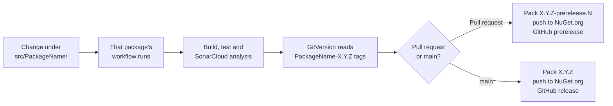

# DfE AI Agents Libraries

.NET libraries for running Azure AI Foundry agents in DfE services. They come with answer checks, cost and
concurrency limits, token telemetry, and optional MCP tools, Azure AI Search evidence, answer scoring and guardrails.

## Packages

| Package | What it does | Docs |
| --- | --- | --- |
| `GovUK.Dfe.AI.Agents` | Core: define, version and run agents, with checks, limits and telemetry | [readme](src/GovUK.Dfe.AI.Agents/readme.md) |
| `GovUK.Dfe.AI.Agents.Mcp` | Tools from your own MCP servers, run in your app | [readme](src/GovUK.Dfe.AI.Agents.Mcp/readme.md) |
| `GovUK.Dfe.AI.Agents.AISearch` | Evidence from Azure AI Search: keyword, semantic or hybrid | [readme](src/GovUK.Dfe.AI.Agents.AISearch/readme.md) |
| `GovUK.Dfe.AI.Agents.Evaluation` | A judge model that scores answers, live and in release gates | [readme](src/GovUK.Dfe.AI.Agents.Evaluation/readme.md) |
| `GovUK.Dfe.AI.Agents.Guardrails` | Foundry guardrails and blocklists on your model deployments | [readme](src/GovUK.Dfe.AI.Agents.Guardrails/readme.md) |

All packages are published to NuGet.org. Each package has its own version (see [Versioning](#versioning)).

## Quick start

```sh
dotnet add package GovUK.Dfe.AI.Agents
```

```csharp
builder.Services.AddAgents(builder.Configuration, agents => agents
    .AddAgents(BriefingAgents.All)
    .AddMcpServers()    // optional add-ons
    .AddAISearch());
```

```csharp
var result = await agents.RunAsync(BriefingAgents.Ofsted, "Summarise the latest inspection.", evidence, ct);
```

The [core readme](src/GovUK.Dfe.AI.Agents/readme.md) covers configuration, defining agents and running them.

## Build and test

Requires the .NET 10 SDK.

```sh
dotnet build GovUK.Dfe.AI.Agents.slnx
dotnet test GovUK.Dfe.AI.Agents.slnx
```

The tests use an in-memory Foundry and need no Azure resources.

## Deployment and versioning

Each package is built, versioned and released on its own



### Workflows

| File | Purpose |
| --- | --- |
| `build-deploy-ai-agents.yml` | Core package. Runs when `src/GovUK.Dfe.AI.Agents/**` changes |
| `build-deploy-ai-agents-{addon}.yml` | One per add-on. Runs when `src/GovUK.Dfe.AI.Agents.{AddOn}/**` changes |
| `build-test-template.yml` | Shared: restore, build, run `src/Tests/{project}.Tests`, SonarCloud analysis |
| `pack-template.yml` | Shared: work out the version, pack, push to NuGet.org and create the GitHub release |

### Versioning

- **Source of truth:** [GitVersion.yml](GitVersion.yml) (ContinuousDelivery mode) and each package's own tags, of the
  form `{PackageName}-X.Y.Z`, e.g. `GovUK.Dfe.AI.Agents-1.0.4` or `GovUK.Dfe.AI.Agents.Mcp-1.0.7`.
- **Pull-request builds:** GitVersion takes the package's latest `X.Y.Z` tag, bumps the patch number and adds a
  prerelease label, e.g. `1.0.5-prerelease.3`. The package is pushed to NuGet.org and the GitHub release is marked as a
  prerelease.
- **Main-branch builds:** merging to `main` produces a clean `X.Y.Z`. It's pushed to NuGet.org, and the GitHub release
  creates the package's next tag.
- **Minor or major bumps:** tag the package's new base version on your branch, then open the PR:

  ```sh
  git tag GovUK.Dfe.AI.Agents.Mcp-2.0.0
  git push origin feature/my-change --tags
  ```

  The PR publishes a `2.0.0` prerelease, and merging to `main` publishes `2.0.0`.

> [!IMPORTANT]
> **The add-ons can't be released until core is on NuGet.org.** They still reference core as a project, and packed that
> way an add-on would depend on core at the **add-on's own version** (e.g. Mcp `1.0.7` on core `1.0.7`), which may not
> exist. So each add-on's pack step fails on purpose with an explanation (the `RequireCorePackageReference` target in its
> `.csproj`); building and testing are unaffected.
>
> Once core's first release is published, in each add-on `.csproj`:
>
> 1. Replace the `ProjectReference` to core with `<PackageReference Include="GovUK.Dfe.AI.Agents" Version="X.Y.Z" />`,
>    as rsd-core-libs does.
> 2. Delete the `RequireCorePackageReference` target.
>
> After that, a change that needs a new core is done in two steps: release core, then bump the add-on's reference.

### Release notes

To add notes to the GitHub release, put this in the body of the commit that gets released (for a squash merge, the
merge commit's description):

```text
(%release-note: Added hybrid search to the AISearch package %)
```

## Adding a new package

1. **Create the project** as `src/GovUK.Dfe.AI.Agents.{Name}/GovUK.Dfe.AI.Agents.{Name}.csproj`, referencing the core
   package (see the note under [Versioning](#versioning)), and add it to [GovUK.Dfe.AI.Agents.slnx](GovUK.Dfe.AI.Agents.slnx).
2. **Create its tests** as `src/Tests/GovUK.Dfe.AI.Agents.{Name}.Tests`. The workflow finds them by this name.
3. **Hook it into `AddAgents`:** implement the internal `IAiAgentsPackage`, add an `agents.Add{Name}()` extension
   method, and add `InternalsVisibleTo` entries for the package and its tests in the core `.csproj`.
4. **Add a workflow** `.github/workflows/build-deploy-ai-agents-{name}.yml`, copied from an existing add-on:

   ```yaml
   name: CI & Pack GovUK.Dfe.AI.Agents.{Name}

   on:
     push:
       branches: [ main ]
       paths:
         - "src/GovUK.Dfe.AI.Agents.{Name}/**"
     pull_request:
       branches: [ main ]
       paths:
         - "src/GovUK.Dfe.AI.Agents.{Name}/**"

   jobs:
     build-and-test:
       uses: ./.github/workflows/build-test-template.yml
       with:
         project_name: GovUK.Dfe.AI.Agents.{Name}
         project_path: src/GovUK.Dfe.AI.Agents.{Name}
       secrets:
         SONAR_TOKEN: ${{ secrets.SONAR_TOKEN }}

     pack-and-release:
       needs: build-and-test
       if: needs.build-and-test.result == 'success'
       permissions:
         contents: write
         packages: write
       uses: ./.github/workflows/pack-template.yml
       with:
         project_name: GovUK.Dfe.AI.Agents.{Name}
         project_path: src/GovUK.Dfe.AI.Agents.{Name}/GovUK.Dfe.AI.Agents.{Name}.csproj
       secrets:
         NUGET_API_KEY: ${{ secrets.NUGET_API_KEY }}
   ```

5. **Document it:** add a `readme.md` (packed into the NuGet package), and add the package to the tables here and in
   the core readme.

## Contributing

1. Branch from `main` and open a pull request.
2. Keep the build free of warnings and SonarCloud issues, and add tests for new behaviour.
3. If your change affects how the packages are used, update the package readme too.
